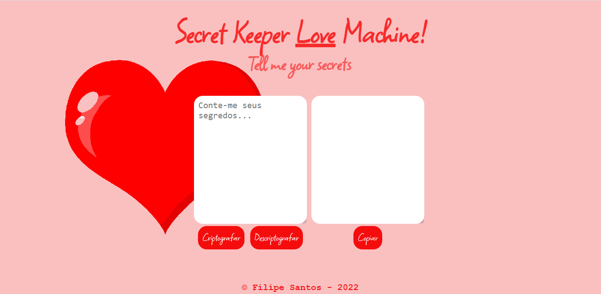

# Decodificador do Amor

> Desafio da Alura

Criei esse decodificador com base no que Alura tinha proposto, que era criptografar/descriptografar e copiar o texto com o click de um botão. 
As letras são substituídas da seguinte forma:

"e" para "enter"
"i" para "imes"
"a" para "ai"
"o" para "ober"
"u" para "ufat"

Gostei muito do resultado!

[🔗 Clique aqui para acessar](https://filipesantos07.github.io/decodificador/)

## 🛠️ Tecnologias

- HTML
- CSS
- JavaScript

## 💛 Contato

outerspaceguy@live.co.uk